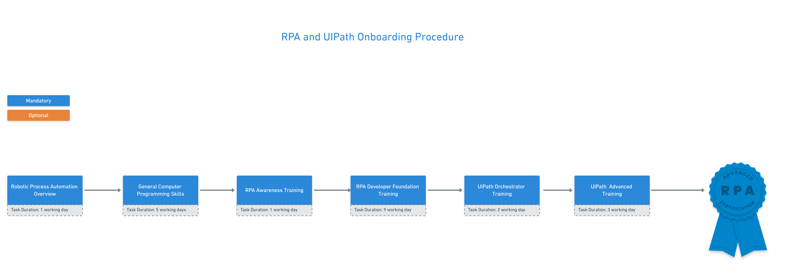
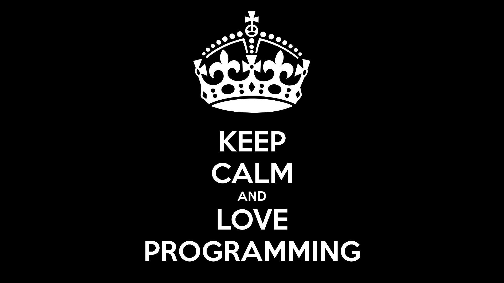

# RPA and UIPath Onboarding Procedure

## Overview
Our goal is to provide a mechanism through which new employees acquire the necessary knowledge, skills, and behaviors to become effective Xocialive members.

### General Overview About Robotic Process Automation (RPA)
**What is RPA (Robotic Process Automation):** Automation of a computer-centric
process using software robots.

[Robotic Process Automation (RPA): How does it work?
](https://www.youtube.com/watch?v=xW95yb6J1eU)

RPA **Aims** to free humans of repetitive tasks by replacing them with a virtual
workforce and enabling them to focus on judgment calls, handle exceptions and
provide oversight.

### RPA Use Cases

* [Use Cases of RPA in Retail Industry](https://www.youtube.com/watch?v=4RWGQdRVGgc)
* [Typical RPA Use Cases](https://www.youtube.com/watch?v=jJIhLHHg6jI)

### General Overview About UiPath Platform    

UiPath is a Robotic Process Automation tool which is used for repetitive business tasks automation. It is used to automate repetitive/redundant tasks and eliminates the human intervention.

The platform is simple to use and has a drag and drop functionality of [activities](https://activities.uipath.com/).

UiPath platform consists of three main components:

* UiPath Studio
* UiPath Robot
* UiPath Orchestrator

[Introducing the UiPath Enterprise RPA Platform
](https://www.youtube.com/watch?time_continue=6&v=cMs-nvxXzZg)

## Technical Onboarding Track `Important`

Our goal in the technical Onboarding track is to craft a mechanism through which you as a new member in our RPA engineering unit acquire the necessary knowledge and skills to become an effective team member. We recommend starting with the `general programming skills` in order to build the foundation required for learning RPA skills. 

### `Step 1` - General Computer Programming Skills

#### Programming Concepts By [freecodecamp](https://www.freecodecamp.org/) 
> If you work in a software development company as a non-programmer, you may wonder what the programmers do. And you hear new buzzwords everyday. This post was written with you in mind. Whether you are a sales person, a medical doctor, attorney, a business lead, or an accountant, if you’ve ever had it in mind to learn how to code, this is a good place to start.

[A Gentler Introduction to Programming](https://medium.freecodecamp.org/a-gentler-introduction-to-programming-1f57383a1b2c)
>**Task duration: 2 days.** For publication reading time plus programming concept awareness.

Recommended path: [Learn to code for free. - freecodecamp](https://www.freecodecamp.org/)

#### A Complete Beginner's Guide to Programming
> This post is going to start out by discussing what computers are at a conceptual level, and then discuss the programming fundamentals. We'll use Python in this post, but a lot of the building blocks work across programming languages, so this will still help even if you are interested in learning a different language at first.    

[A Complete Beginner's Guide to Programming](https://dev.to/aspittel/a-complete-beginner-s-guide-to-programming-2ni4)

Your **target** here is to read the publication above and practice the same programming fundamentals using [C#](https://docs.microsoft.com/en-us/dotnet/csharp/programming-guide/) programming language.

**Recommendation**

We recommend using C# Online Compiler like [dotnetfiddle](https://dotnetfiddle.net/).

> **Task duration: 3 days.** For publication reading time plus practicing programming fundamentals.

#### C# Tutorial `Important`

> The SoloLearn C# course makes the 10th programming language available to our community for FREE!
> 
> **Learn**
> Gain an understanding of C# concepts by going through short interactive texts and follow-up fun quizzes. Topics include: 
> * Variables, 
> * conditional statements and loops, 
> * Methods, 
> * Classes, 
> * Arrays, 
> * Strings, 
> * Encapsulation, 
> * Inheritance, 
> * Polymorphism, 
> * Interfaces, 
> * Exceptions, 
> * Generics, 
> * And more!

[C# Tutorial](https://www.sololearn.com/Course/CSharp/)
> **Task duration: 3 days.** 

<!-- #### `Optional Tutorial`: Get Started with Visual Basic in Visual Studio

> In this tutorial for Visual Basic (VB), you'll use Visual Studio to create and run a few different console apps and explore some features of the Visual Studio integrated development environment (IDE) while you do so.

[Get started with Visual Basic in Visual Studio](https://docs.microsoft.com/en-us/visualstudio/get-started/visual-basic/tutorial-console?view=vs-2019)

> **Task duration: 1 days.** For practicing the tutorial.  -->

####  What is Source Control?

> **Source control** (or **version control**) is the practice of tracking and managing changes to code. Source control management (SCM) systems provide a running history of code development and help to resolve conflicts when merging contributions from multiple sources.

**Source Control Basics**

Whether you are writing a simple application on your own or collaborating on a large software development project as part of a team, source control is a vital component of the development process. Source code management systems allow you to track your code change, see a revision history for your code, and revert to previous versions of a project when needed. With source code management systems, you can collaborate on code with your team, isolate your work until it is ready, and quickly trouble-shoot issues by identifying who made changes and what the changes were. Source code management systems help streamline the development process and provide a centralized source for all your code.

[What is Source Control? Amazon](https://aws.amazon.com/devops/source-control/)

[Intro to Source Control: A Must-Have Tool for Programmers](https://www.youtube.com/watch?v=K0mgc3efx-A)

**Team Foundation Server (TFS)**

Team Foundation Server (commonly abbreviated to TFS) is a Microsoft product that provides source code management (either with Team Foundation Version Control or Git), reporting, requirements management, project management (for both agile software development and waterfall teams), automated builds, lab management, testing and release management capabilities. It covers the entire application lifecycle, and enables DevOps capabilities. TFS can be used as a back-end to numerous integrated development environments (IDEs) but is tailored for Microsoft Visual Studio and Eclipse on all platforms.

[What is TFS?](https://www.youtube.com/watch?v=WxQFrbkoxrw)

> **Task duration: 1 days.** For Source Control Awareness.

### `STEP 2` - RPA Awareness Training

>Training overview: his Academy module is centered on RPA fundamentals - the definition of RPA, the way in which companies are exploring this technology, and the benefits that can be achieved using it. The lessons also include guidelines on selecting the appropriate processes for automation, as well as strategies for successful RPA implementations. The course comprises general information about UiPath as a company, and an overview of the UiPath RPA solution as well.

**Learning goals**: Gaining a clear understanding about the RPA industry and benefits, understanding the limits and constraints of automation.

**Agenda**:
1. The basics of RPA
2. Processes fit for RPA
3. RPA Journey & COE Enablement
4. Introduction to UiPath

[RPA Academy](https://www.uipath.com/rpa/academy/training)

>**Task duration: 1 days.**

### `STEP 3` - RPA Developer Foundation Training

> Training overview: Dedicated to beginner-level users, the RPA Developer Foundation Training is designed to walk you through the essentials of UiPath. Covering theoretical concepts as well as hands-on exercises and quizzes, this training will enable you to build a good knowledge of UiPath features and technology.

**Learning Goals**: Understanding of the basic UiPath components, features and technology.

**Agenda**:
 
1. Introduction
2. Variables, Data Types & Control Flow
3. Data Manipulation
4. Recording
5. Advanced UI Interaction
6. Selectors
7. Image & Text Automation
8. Advanced Citrix Automation
9. Excel & Data Tables
10. PDF
11. Email Automation
12. Debugging & Exception Handling
13. Project Organization

[RPA Academy](https://www.uipath.com/rpa/academy/training)

>**Task duration: 9 days.**

### `STEP 4` - UiPath Orchestrator Trainings

> Training overview: This module presents the basic and advanced Orchestrator features and functionalities. The course includes a set of practical exercises that can be done in the free training environment.

**Learning Goals**: Understanding the purpose and use of the control center - UiPath Orchestrator, understanding how to deploy and trigger a process, understanding how to provision a Robot, understanding Assets and Queues.

**Agenda**:
 
1. How to deploy and trigger a process
2. How to publish a UiPath workflow
3. How to create an environment
4. How the job queue works, handling pending jobs, canceling and terminating jobs
5. How to schedule jobs
6. How the job queue works, handling pending jobs, canceling and terminating jobs
7. How to monitor of all Robots registered to the Orchestrator
8. How levels of error messages are communicated
9. What are UiPath Orchestrator assets?
10. How to store credentials in the Orchestrator
11. What are Orchestrator queues?
12. How to use queues to work with lists of items that are handled by multiple Robots
13. How to add items to queues and how to get transaction items

**Prerequisites**: RPA Developer Foundation Training / RPA Awareness Training

[RPA Academy](https://www.uipath.com/rpa/academy/training)

>**Task duration: 2 days.**

### `STEP 5` - RPA Developer Advanced Training

> Training overview: Building on top of the RPA Developer Foundation training, this course explains how to leverage all the functionalities of UiPath Studio through the means of a specially built application that simulates the production environment experience. The module focuses on a hands-on approach that follows the carefully articulated best practices which empower users to build clean and efficient automation solutions.

**Learning Goals**: Understanding of the REFramework; understanding of the UiPath Best practices, ability to build an end-to-end functional and qualitative automation project.

**Agenda**:
 
1. Introduction to UiPAth REFramework
2. Automation Scenario 1 - Calculate Client Security Hash
3. Automation Scenario 2 - Generate Yearly Reports

**Prerequisites**: RPA Developer Foundation Training, Orchestrator Training

[RPA Academy](https://www.uipath.com/rpa/academy/training)

>**Task duration: 3 days.**

### `STEP 6` - RPA Developer Advanced Certification

**What is the UiPath RPA Developer Advanced Certification?**

The Certificate attests that the graduate has attained in-depth knowledge about the UiPath components and features. It also validates the graduate's ability to successfully automate a real-life project based on UiPath best practices and automation principles, thus being qualified to fulfill any of the key roles in an RPA Center of Excellence.

**The Certification Exam Has 2 Phases:**

* **Phase I** - Theoretical exam (Quiz)

    You can take the quiz anytime. After you comply with the Legal & Payment terms, you have **90 minutes** at your disposal to answer 45 multiple answer questions, with a minimum passing score of 70%. You have three attempts to pass the quiz, otherwise a new payment will be required. Keep in mind that you have to wait 24H before attempting to take the quiz again. 

* **Phase II** - Practical exam

    Once you have passed your theoretical exam, you can enroll for the practical one at any time, by starting your own session, which doesn’t require any supervision. 

    You have **3 h and 30 m** at your disposal to solve the exercise displayed, with a minimum passing score of 70%. Keep in mind that there are only three attempts to pass the practical exam, otherwise a new voucher will be required. Last but not least, you have to wait 24H before attempting to take the exam again.

    The exam consists of one exercise, with automatic randomization enabled. Before the session ends, the user will have to upload the workflow to UiPath Certification Platform. The evaluation will be done automatically in background, based on criteria configured by UiPath. The waiting period time is 60 minutes.

**You will become certified only if you pass both phases**, and will be able to view and download your certificate directly from the platform. For tracking purposes, each certificate will have a unique identification number attached. You will receive a short survey that will help us gather feedback on your certification experience before viewing your certificate. 