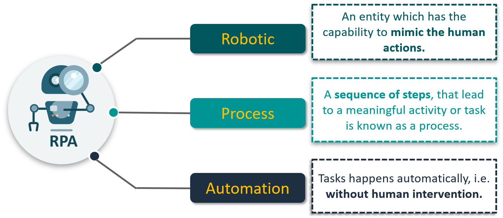
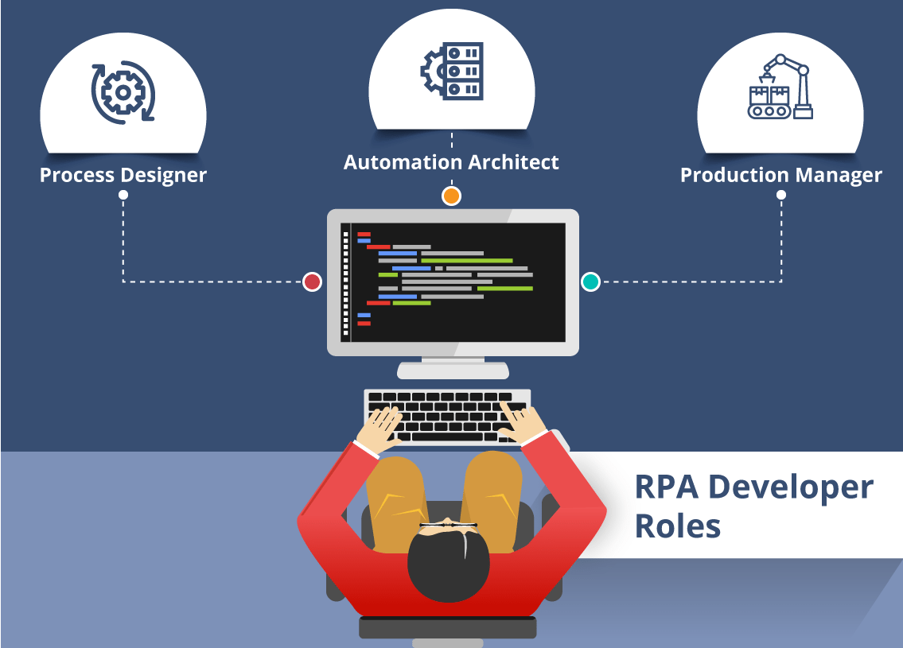

# RPA and UIPath Onboarding Procedure

## Overview

Our goal is to provide a mechanism through which new employees acquire the necessary knowledge, skills, and behaviors to become effective Xocialive members.

### General Overview About Robotic Process Automation (RPA)
**What is RPA (Robotic Process Automation):** Automation of a computer-centric
process using software robots.

[Robotic Process Automation (RPA): How does it work?
](https://www.youtube.com/watch?v=xW95yb6J1eU)

RPA **Aims** to free humans of repetitive tasks by replacing them with a virtual
workforce and enabling them to focus on judgment calls, handle exceptions and
provide oversight.

### General Overview About UIPath Platform    

UiPath is a Robotic Process Automation tool which is used for repetitive business tasks automation. It is used to automate repetitive/redundant tasks and eliminates the human intervention.

The platform is simple to use and has a drag and drop functionality of [activities](https://activities.uipath.com/).

UiPath platform consists of three main components:

* UiPath Studio
* UiPath Robot
* UiPath Orchestrator

[Introducing the UiPath Enterprise RPA Platform
](https://www.youtube.com/watch?time_continue=6&v=cMs-nvxXzZg)

## Technical Onbording Track `IMPORTANT`

Our goal in the technical Onbording track is to craft a mechanism through which you as a new member in our RPA engineering unit acquire the necessary knowledge and skills to become an effective team member. We recommend starting with the `general programming skills` in order to build the foundation required for learning RPA skills. 

### `Step 1` - General Computer Programming Skills

#### Programming Concepts By [freecodecamp](https://www.freecodecamp.org/) 
> If you work in a software development company as a non-programmer, you may wonder what the programmers do. And you hear new buzzwords everyday. This post was written with you in mind. Whether you are a sales person, a medical doctor, attorney, a business lead, or an accountant, if you’ve ever had it in mind to learn how to code, this is a good place to start.

[A Gentler Introduction to Programming](https://medium.freecodecamp.org/a-gentler-introduction-to-programming-1f57383a1b2c)
>**Task duration: 2 days.** For publication reading time pluse programming concept awarnace.

Recommended path: [Learn to code for free. - freecodecamp](https://www.freecodecamp.org/)

#### A Complete Beginner's Guide to Programming
> This post is going to start out by discussing what computers are at a conceptual level, and then discuss the programming fundamentals. We'll use Python in this post, but a lot of the building blocks work across programming languages, so this will still help even if you are interested in learning a different language at first.    

[A Complete Beginner's Guide to Programming](https://dev.to/aspittel/a-complete-beginner-s-guide-to-programming-2ni4)

Your target here is to read the publication above and practise the same programming fundamentals using VB.NET programming language as `UIPath Studio` using VB.NET for activites macro coding.  
> **Task duration: 3 days.** For publication reading time plus practicing programming fundamentals.

### `STEP 2` - RPA Awareness Training

>Training overview: his Academy module is centered on RPA fundamentals - the definition of RPA, the way in which companies are exploring this technology, and the benefits that can be achieved using it. The lessons also include guidelines on selecting the appropriate processes for automation, as well as strategies for successful RPA implementations. The course comprises general information about UiPath as a company, and an overview of the UiPath RPA solution as well.

**Learning goals**: Gaining a clear understanding about the RPA industry and benefits, understanding the limits and constraints of automation.

**Agenda**:
1. The basics of RPA
2. Processes fit for RPA
3. RPA Journey & COE Enablement
4. Introduction to UiPath

[RPA Academy](https://www.uipath.com/rpa/academy/training)

>**Task duration: 1 days.**

### `STEP 3` - RPA Developer Foundation Training

> Training overview: Dedicated to beginner-level users, the RPA Developer Foundation Training is designed to walk you through the essentials of UiPath. Covering theoretical concepts as well as hands-on exercises and quizzes, this training will enable you to build a good knowledge of UiPath features and technology.

**Learning Goals**: Understanding of the basic UiPath components, features and technology.

**Agenda**:
 
1. Introduction
2. Variables, Data Types & Control Flow
3. Data Manipulation
4. Recording
5. Advanced UI Interaction
6. Selectors
7. Image & Text Automation
8. Advanced Citrix Automation
9. Excel & Data Tables
10. PDF
11. Email Automation
12. Debugging & Exception Handling
13. Project Organization
